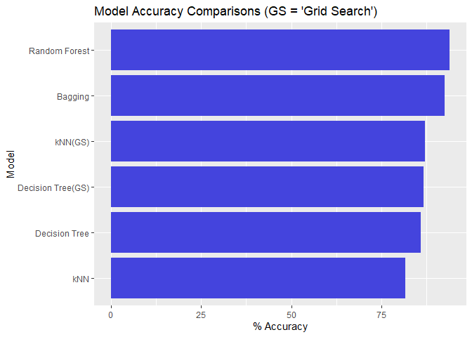

Using Various Machine Learning Models to Predict Popularity of Songs on
Spotify
================

With the increasing dominance of streaming platforms for music,
understanding the music industry has become more about understanding the
listening behavior on these platforms. Here, we sought to fit machine
learning models which could accurately predict if a song is popular. We
used a data set from songs on Spotify with 13 Spotify-defined features
for each of 19,000 songs and their relative popularity on Spotify. We
also tested for feature importance in predicting popularity to get a
sense of what kinds of acoustic features of music make it popular. We
then fit several models with different hyper parameters and ranked their
performance. Below is an example of a sample of rows and columns of the
data used.

    ##                     song_name song_popularity song_duration_ms acousticness
    ## 1: Boulevard of Broken Dreams              73           262333     0.005520
    ## 2:                 In The End              66           216933     0.010300
    ## 3:          Seven Nation Army              76           231733     0.008170
    ## 4:                 By The Way              74           216933     0.026400
    ## 5:          How You Remind Me              56           223826     0.000954

Below we have displayed a chart of the performances for each of the
models used. The percentages represent the accuracy of the trained model
on the test set. We split the full data set into 80% training and 20%
testing.

<!-- -->

For more information on the specifics of our methods and a discussion of
our model diagnostics, see [Final\_Report.pdf](Final_Report.pdf) above.

A video presentation of our project can be viewed
[here](Presentation_Materials/Video%20Presentation%20of%20ML%20models%20of%20Song%20Popularity.mp4).
